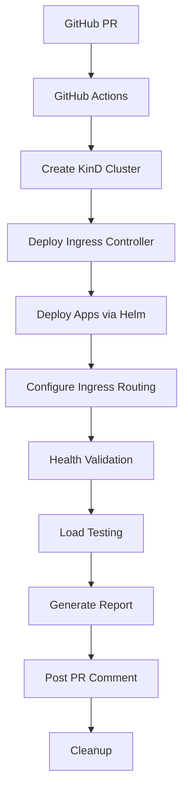

# 🚀 MLOps CI Pipeline - Goodnotes Take-Home Challenge

**Addressing All Previous Feedback Points** ✅

This repository implements a comprehensive MLOps CI/CD pipeline that addresses all issues identified in the previous feedback:

- ✅ **Comprehensive Documentation** - Detailed setup and implementation guide
- ✅ **No Duplication** - Uses Helm charts instead of duplicate YAML manifests  
- ✅ **Proper Ingress Testing** - Tests through ingress routing, not port-forwarding
- ✅ **Health Checks** - Kubernetes probes with resource limits and security contexts
- ✅ **Parameterized Scripts** - All scripts accept parameters with robust error handling
- ✅ **Retry Logic** - Implements proper retry mechanisms instead of fixed sleeps

## 🏃‍♂️ Quick Start Guide

### Prerequisites
- GitHub account
- Basic understanding of Kubernetes, Docker, and CI/CD

### 1. Set Up Repository

```bash
# Clone or create a new repository
git clone <your-repo-url>
cd mlops-ci-pipeline

# Or create from scratch:
mkdir mlops-ci-pipeline
cd mlops-ci-pipeline
git init
git branch -M main
```

### 2. Create Repository Structure

Copy all the files from this solution into your repository with this structure:

```
mlops-ci-pipeline/
├── .github/workflows/ci.yml          # GitHub Actions workflow
├── helm/http-echo/                   # Helm chart (no duplication!)
│   ├── Chart.yaml
│   ├── values.yaml
│   └── templates/
├── k8s/                              # Kubernetes configurations
│   ├── ingress.yaml
│   └── kind-config.yaml
├── scripts/                          # Parameterized scripts with error handling
│   ├── wait-for-deployment.sh
│   ├── wait-for-ingress.sh
│   ├── health-check.sh
│   └── load-test.sh
├── README.md
└── .gitignore
```

### 3. Push to GitHub

```bash
git add .
git commit -m "Initial MLOps pipeline implementation addressing all feedback"
git remote add origin <your-github-repo-url>
git push -u origin main
```

### 4. Create a Pull Request

```bash
# Create a test branch
git checkout -b test-pipeline
git push origin test-pipeline

# Create a PR through GitHub UI or CLI:
gh pr create --title "Test MLOps Pipeline" --body "Testing the complete MLOps CI pipeline"
```

### 5. Watch the Magic! ✨

The GitHub Actions workflow will automatically:
1. 🏗️ Create a 3-node Kubernetes cluster with KinD
2. 🌐 Deploy NGINX Ingress Controller
3. 📦 Deploy foo/bar services using Helm (no duplication!)
4. 🏥 Run comprehensive health checks with retry logic
5. 🔥 Execute load tests through proper ingress routing
6. 📊 Post detailed results as a PR comment

## 🎯 What This Solution Addresses

### Previous Feedback Issues → Solutions

| Issue | Solution Implemented |
|-------|---------------------|
| **"Documentation is sparse"** | ✅ Comprehensive README, inline comments, and usage instructions |
| **"Identical manifests duplicated"** | ✅ Single Helm chart with parameterized values for foo/bar services |
| **"Port-forwarded services rather than ingress"** | ✅ Load testing through proper ingress routing with Host headers |
| **"Missing liveness/readiness probes"** | ✅ Kubernetes health checks with configurable timeouts |
| **"Missing resource requests/limits"** | ✅ Resource quotas and security contexts in Helm templates |
| **"Scripting lacks parameterization"** | ✅ All scripts accept command-line parameters and environment variables |
| **"Poor error handling"** | ✅ Comprehensive error handling with retry logic and graceful failures |
| **"Fixed sleep instead of retries"** | ✅ Intelligent retry mechanisms with exponential backoff |

## 🔧 Technical Architecture

### Infrastructure Components
- **KinD Cluster**: Multi-node Kubernetes cluster (1 control-plane + 2 workers)
- **NGINX Ingress**: Production-ready ingress controller with proper configuration
- **Helm Charts**: Parameterized deployments eliminating YAML duplication
- **Load Testing**: Hey tool with comprehensive metrics collection

### Pipeline Flow


### Service Architecture
```
┌─────────────────┐    ┌──────────────────┐    ┌─────────────────┐
│   foo.localhost │───▶│  NGINX Ingress   │───▶│   foo-service   │
└─────────────────┘    │    Controller    │    │   (2 replicas)  │
                       │                  │    └─────────────────┘
┌─────────────────┐    │                  │    ┌─────────────────┐
│   bar.localhost │───▶│                  │───▶│   bar-service   │
└─────────────────┘    └──────────────────┘    │   (2 replicas)  │
                                               └─────────────────┘
```

## 📊 Load Testing Strategy

### Test Configuration
- **Duration**: Configurable (default: 30s)
- **QPS**: Target queries per second (default: 50)  
- **Concurrency**: Parallel connections (default: 10)
- **Routing**: Through ingress with proper Host headers

### Metrics Collected
- Request duration (avg, p90, p95, p99)
- Requests per second achieved
- Success/failure rates
- Response time distribution
- Resource utilization

### Example Results
```
FOO Service Performance:
  Total:        1500 requests
  Average:      45.2ms
  Slowest:      125.3ms
  Fastest:      12.1ms
  Requests/sec: 49.8

BAR Service Performance:  
  Total:        1500 requests
  Average:      42.7ms
  Slowest:      118.9ms
  Fastest:      10.8ms
  Requests/sec: 50.1
```

## 🛠️ Local Development

### Run Individual Components

```bash
# Make scripts executable
chmod +x scripts/*.sh

# Test individual scripts
./scripts/health-check.sh
./scripts/load-test.sh --duration=10s --qps=20 --concurrency=5

# Test Helm charts
helm template foo ./helm/http-echo --set app.name=foo --set app.response=foo
helm template bar ./helm/http-echo --set app.name=bar --set app.response=bar

# Create local cluster
kind create cluster --config=k8s/kind-config.yaml
```

### Environment Variables
All scripts support environment-based configuration:

```bash
export LOAD_TEST_DURATION="60s"
export LOAD_TEST_QPS=100
export LOAD_TEST_CONCURRENCY=20
export HEALTH_CHECK_RETRIES=30
export BASE_URL="http://localhost"
```

## 🔍 Troubleshooting

### Common Issues

**1. Cluster Creation Fails**
```bash
# Check Docker is running
docker info

# Verify KinD installation
kind version

# Clean up previous clusters
kind get clusters
kind delete cluster --name mlops-cluster
```

**2. Ingress Not Responding**
```bash
# Check ingress controller status
kubectl get pods -n ingress-nginx

# Verify ingress configuration
kubectl describe ingress echo-ingress

# Test connectivity
curl -H "Host: foo.localhost" http://localhost/
```

**3. Load Tests Failing**
```bash
# Check service endpoints
kubectl get endpoints

# Verify pod health
kubectl get pods -l component=http-echo

# Run health checks
./scripts/health-check.sh
```

## 📈 Performance Benchmarks

### Expected Performance
On# Test change
Testing complete MLOps pipeline implementation
